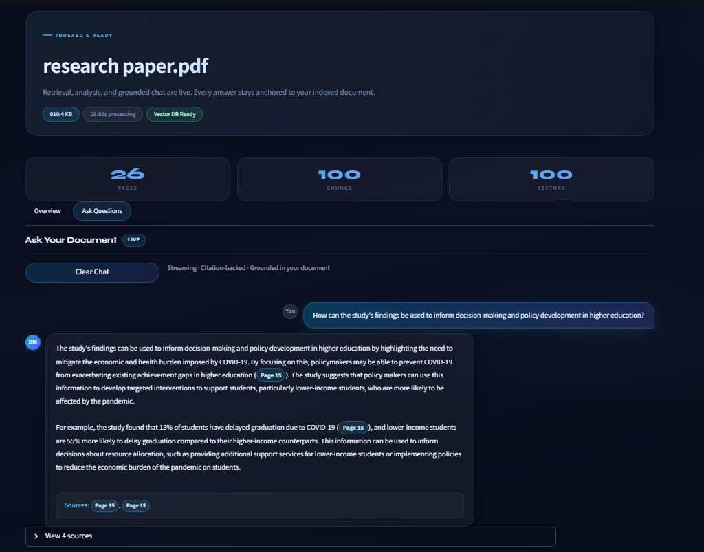
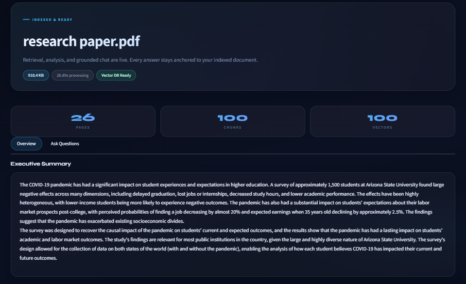
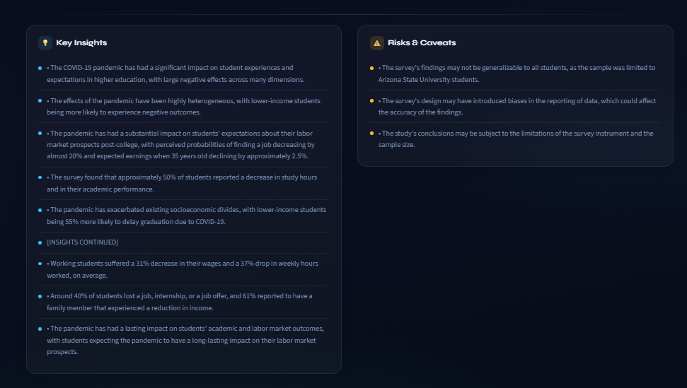

# DocuMind AI
### Production-Ready RAG System for Enterprise PDF Intelligence

<p align="center">
  Retrieval-grounded question answering and analysis for complex PDF documents.
</p>

<p align="center">
  
  
  
  
</p>

---

## Overview

DocuMind AI is a Retrieval-Augmented Generation (RAG) system built for querying and analyzing long-form PDFs using semantic retrieval and citation-backed response generation.

The project focuses on reducing hallucinations in document-based question answering by retrieving relevant local context before response generation.

The pipeline combines:
- PDF parsing
- semantic chunking
- vector search
- retrieval-grounded prompting
- low-latency inference using Groq Llama 3.1

---

## Preview

### Multi-Stage RAG Chat

Context-aware retrieval with citation-backed response generation using Streamlit session state.



---

### Retrieval & Indexing Pipeline

Document ingestion, chunk generation, vector indexing, and retrieval state visualization.



---

### Analytical Insight Extraction

Structured extraction of key findings, risks, and contextual summaries from indexed documents.



---

## Why RAG?

Standard LLMs struggle with hallucinations and context drift when working with long-form or domain-specific documents.

DocuMind AI solves this by retrieving relevant document chunks before generation, giving the model localized context for every response instead of relying entirely on pretrained memory.

This improves:
- factual consistency
- source traceability
- retrieval relevance
- adaptability across different document domains

---

## Retrieval Pipeline

1. PDF ingestion and parsing using PyMuPDF  
2. Semantic chunk generation with overlap handling  
3. Dense vector embedding generation  
4. FAISS-based Top-K similarity retrieval  
5. Retrieval-grounded response generation using Groq Llama 3.1  

---

## Core Components

### Retrieval Pipeline

- FAISS-based semantic similarity search
- Top-K contextual retrieval
- SentenceTransformer embeddings
- Chunk overlap strategy for context continuity

### Document Processing

- PDF parsing using PyMuPDF
- Semantic text segmentation
- Metadata-aware indexing
- Context-preserving chunk generation

### Response Generation

- Retrieval-grounded prompting
- Citation-backed responses
- Context-aware synthesis using Groq Llama 3.1
- Single-pass inference workflow

### Session Handling

- Streamlit session state management
- Cached vector persistence
- Stateful document interaction

---

## Engineering Decisions

| Decision | Reasoning |
|---|---|
| Retrieval-Augmented Generation instead of fine-tuning | Easier domain adaptation and stronger factual grounding |
| FAISS vector indexing | Fast similarity search with low retrieval latency |
| Semantic chunk overlap | Helps preserve context across chunk boundaries |
| Groq inference | Lower response latency during generation |
| Modular pipeline design | Easier debugging and future backend migration |
| Citation-backed responses | Makes outputs easier to verify |

---

## Architecture

```text
                   ┌────────────────────┐
                   │    Streamlit UI    │
                   └─────────┬──────────┘
                             │
                             ▼
                ┌────────────────────────┐
                │ Workflow Control Layer │
                └───────┬───────┬────────┘
                        │       │
            ┌───────────┘       └────────────┐
            ▼                                ▼
    ┌────────────────┐              ┌────────────────┐
    │ PDF Parser      │              │  LLM Engine    │
    │ (PyMuPDF)       │              │ (Groq Llama)   │
    └────────┬────────┘              └────────┬───────┘
             │                                │
             ▼                                │
    ┌────────────────┐                        │
    │ Semantic        │                        │
    │ Chunking Engine │                        │
    └────────┬────────┘                        │
             ▼                                │
    ┌────────────────┐                        │
    │ Embedding Model │                        │
    │ SentenceTransf. │                        │
    └────────┬────────┘                        │
             ▼                                ▼
          ┌─────────────────────────────────────┐
          │     FAISS Vector Database           │
          └─────────────────────────────────────┘
```

---

## Tech Stack

| Layer | Technology |
|---|---|
| Frontend | Streamlit |
| Backend | Python |
| LLM Inference | Groq API (Llama 3.1) |
| Embeddings | Sentence Transformers |
| Vector Search | FAISS |
| PDF Parsing | PyMuPDF |

---

## Project Structure

```text
DocuMind/
│
├── assets/
│   ├── chat-interface.png
│   ├── executive-summary.png
│   └── insights-analysis.png
│
├── core/
│   ├── agentic_engine.py
│   ├── ai_engine.py
│   ├── chunker.py
│   ├── embedder.py
│   ├── qa_engine.py
│   ├── session_manager.py
│   └── vectordb.py
│
├── uploads/
├── .streamlit/
│   └── secrets.toml
│
├── app.py
├── requirements.txt
└── README.md
```

---

## Performance Notes

| Metric | Observation |
|---|---|
| Average response latency | ~2–4 seconds |
| Retrieval strategy | Top-K semantic retrieval |
| Large document handling | Chunked vector indexing |
| Inference flow | Single-pass generation |

Performance varies depending on:
- document size
- chunk count
- embedding generation time
- local hardware resources

---

## Current Constraints

- Large PDFs (>100 pages) can increase indexing latency on CPU-only environments.
- Complex nested tables may lose formatting during extraction.
- Retrieval quality depends heavily on chunking strategy and embedding quality.
- OCR support for scanned PDFs is not yet implemented.
- Session memory is currently limited to active runtime state.

---

## Planned Improvements

- Multi-document retrieval
- Conversational memory
- OCR pipeline for scanned documents
- GraphRAG experimentation
- FastAPI backend migration
- API-based deployment architecture
- Multi-user session support

---

## Installation

### 1. Clone the Repository

```bash
git clone https://github.com/your-username/documind-ai.git
cd documind-ai
```

---

### 2. Create a Virtual Environment

#### Windows

```bash
python -m venv venv
venv\Scripts\activate
```

#### macOS/Linux

```bash
python -m venv venv
source venv/bin/activate
```

---

### 3. Install Dependencies

```bash
pip install -r requirements.txt
```

---

### 4. Configure API Keys

Create:

```bash
.streamlit/secrets.toml
```

Add:

```toml
GROQ_API_KEY = "your_api_key_here"
GROQ_MODEL_NAME = "llama-3.1-8b-instant"
```

---

### 5. Run the Application

```bash
streamlit run app.py
```

---

## Example Use Cases

### Research Paper Analysis
Ask contextual questions over long-form academic papers.

### Enterprise Knowledge Retrieval
Search internal documentation using semantic retrieval.

### Technical Documentation QA
Retrieve implementation details from engineering documents.

### Risk & Insight Extraction
Generate structured summaries and risk observations from reports.

---

## Developer

### Sujanya Srinivas

AI/ML Engineer focused on:
- Retrieval-Augmented Generation (RAG)
- NLP Systems
- Semantic Search
- Applied Generative AI
- Scalable AI Workflows

---

## License

This project is intended for educational, research, and portfolio use.
